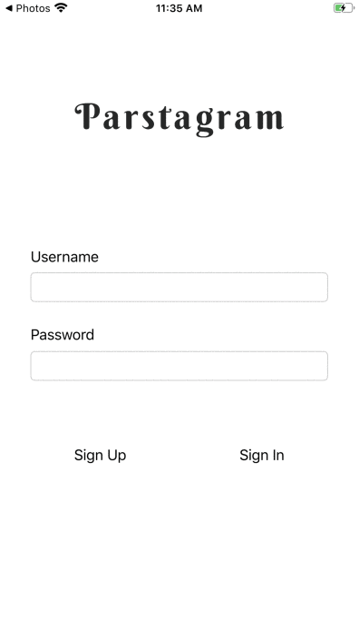

# Parstagram - Part I

This is an Instagram clone with a custom Parse backend that allows a user to post photos and view a global photos feed.

Part I Time spent: 5 hours 
Part II Time spent: 3 hours 

## User Stories Part II

The following **required** functionality is completed:

- [x] User stays logged in across restarts. (1pt)
- [x] User can log out. (1pt)
- [x] User can view comments on a post. (3pts)
- [x] User can add a new comment. (5pts)

The following **bonus** features are implemented:

- [ ] User can add a profile picture. (2pts)
- [ ] Profile pictures are shown for posts and comments. (2pts)

## Video Walkthrough Part II

Here's a walkthrough of implemented user stories:

## User Stories Part I

The following **required** functionality is completed:

- [X] User sees app icon in home screen and styled launch screen. (1pt)
- [X] User can sign up to create a new account. (1pt)
- [X] User can log in. (1pt)
- [X] User can take a photo, add a caption, and post it to the server. (3pt)
- [X] User can view the last 20 posts. (4pts)

The following **bonus** features are implemented:

- [X] User can pull to refresh. (1pt)
- [X] User can load past tweets infinitely. (2pts)

## Video Walkthrough Part I

Here's a walkthrough of implemented user stories:

